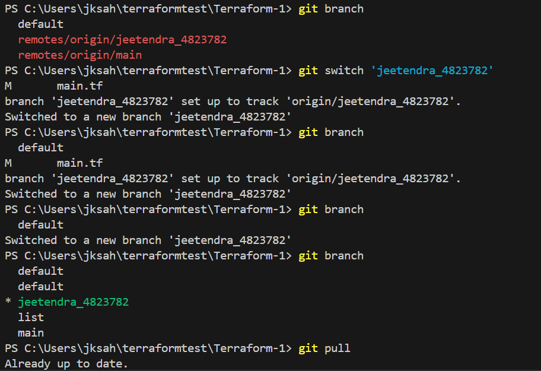
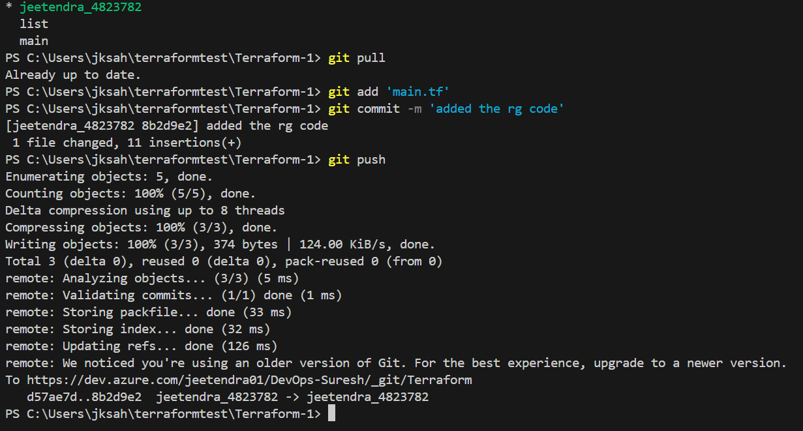
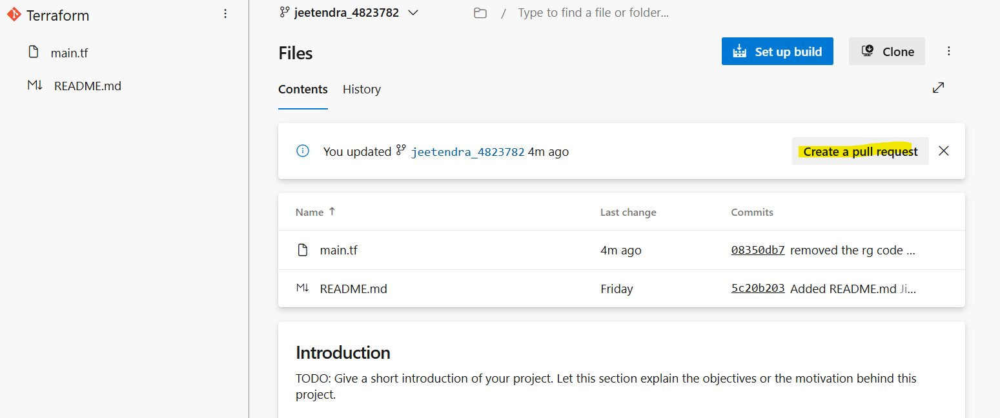

**Azure Repos**

create branch on repo
clone the branch in VS

*Change the branch into the Azure repo through the commands*

git switch "branch name"

*Update the code and cummit to the branch*

after updating the code we need to runthe following commands:-

git add "main.tf" 
git commit -m "updated the aks config"
git push
git branch

git pull 

********************************************************************

**PR Pull Request**

**Branch Policy**

Application ---> Build (Restore, SonarScan, Test, Build, Push Artifact)