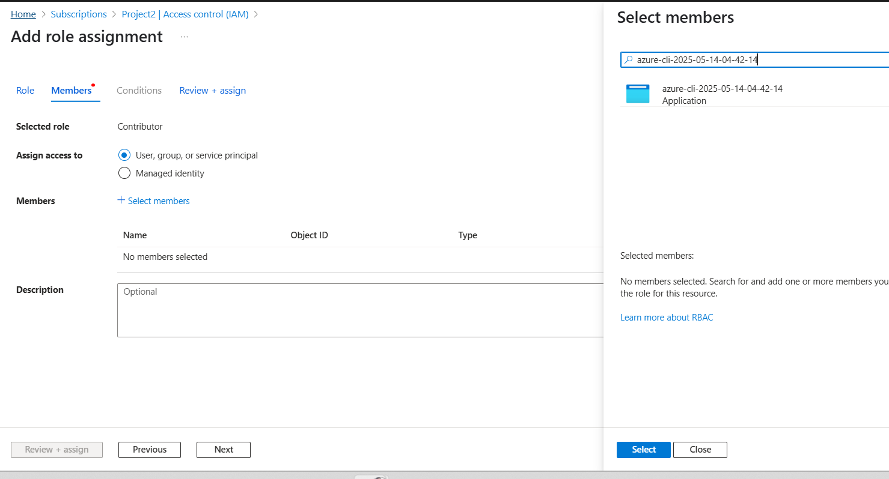
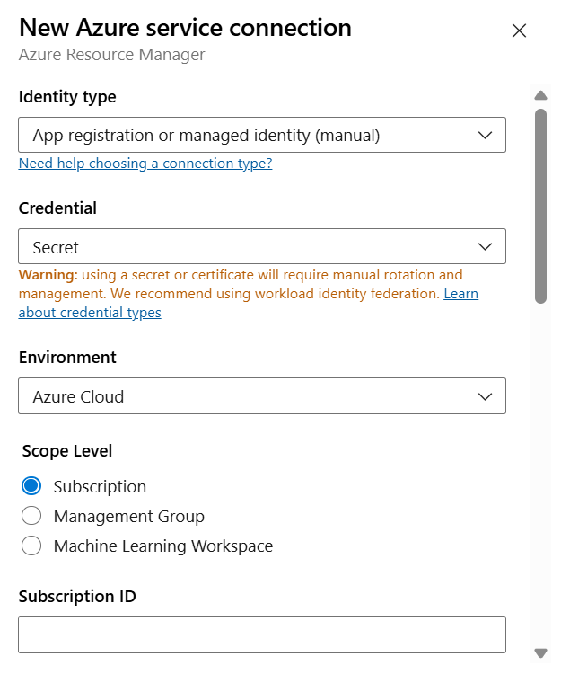
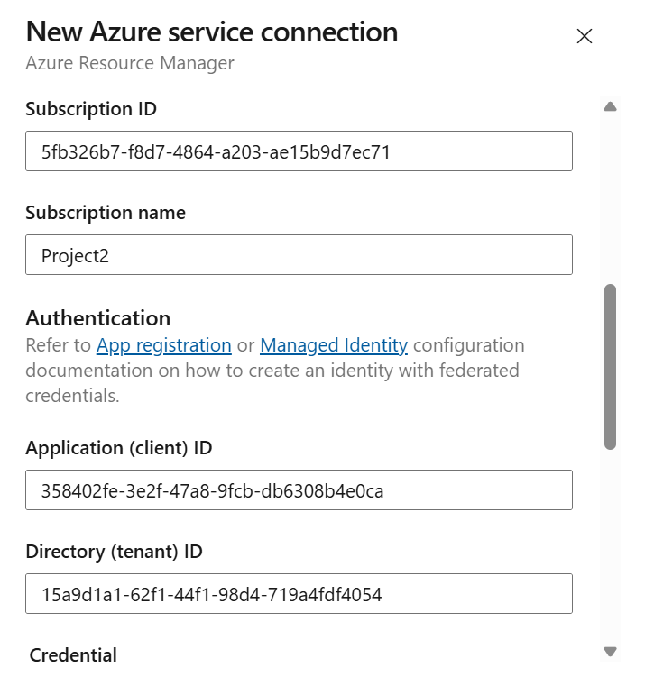

**Terraform Azure Pipeline**

Requirement -- 
1. Create a Service Connection -- It will allow DevOps to loging into other service (Azure Cloud) --Done
2. Create Terraform Code  ---Done
3. Create Storage account for Terraform Backend 
4. Create TF Pipeline for plan and Apply.

Create a Service connection ---

1. Create Service Principle on Azure through Powershell -- 

az ad sp create-for-rbac

2. Assign IAM Role to the Service Principle

3. Create Service connection 

Project Setting --> Service Connection ---> Create Service Connection --->Azure Resource Manager ---> 
Next --> IdentityType App registration manully --> Credentils Secrets -->

Create Terraform Pipeline ---

New Pipeline ---Select the Source Code --->Select Repo --->Select Starter Pipeline --->

