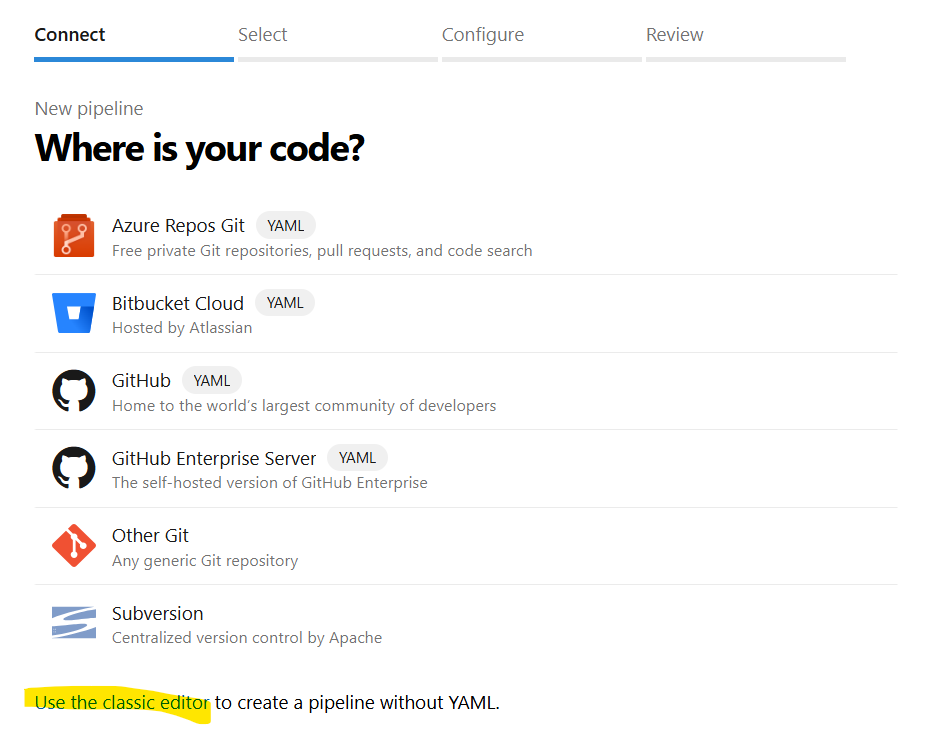

**Classic Azure Pipeline**

This is old way and UI based to create the pipeline.

Create a new Terraform classic pipeline -- 

New pipeline -->Use the Classic editor -->Select Rpository --- And click on emty job -->provide the build name and save.  

Edit and add the tasks:-

