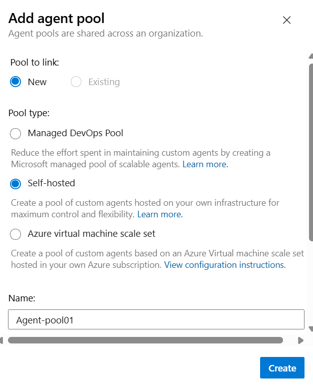
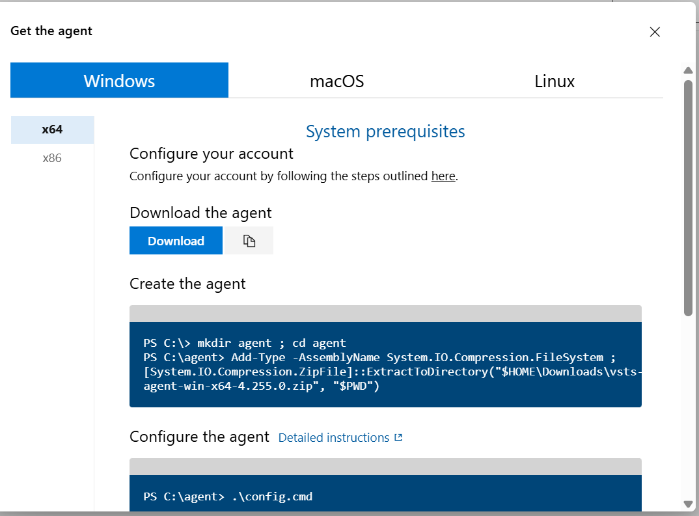
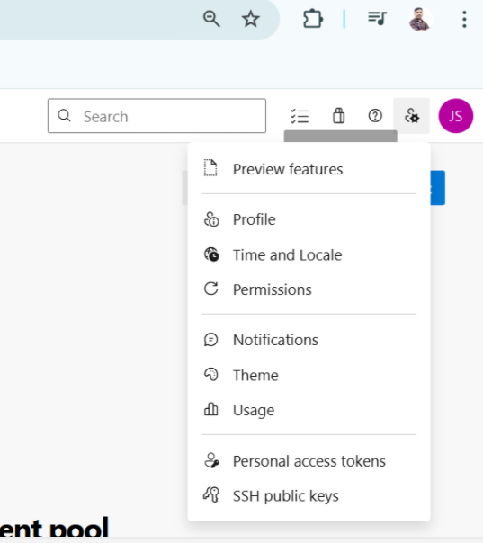
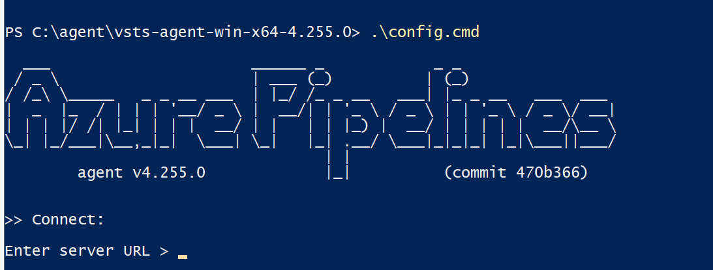
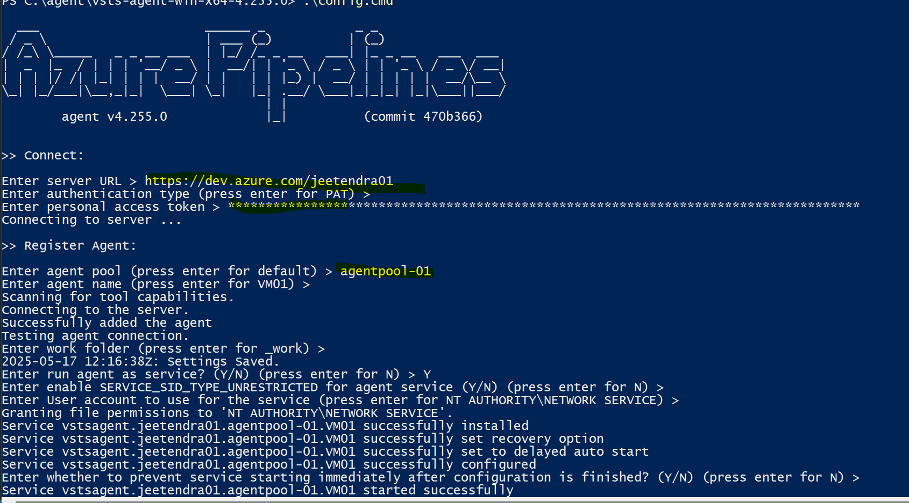

**Azure DevOps Agent**

Agent? \\

Microsfot Hosted
Self Hosted Agent

How to setup Self hosted Agent on DevOps -- ? 

Requirement 

1. VM
2. PAT

-------------

Configure the Agent 

Go to Project Setting ----> Agent pool ---> Add Pool ----> Select Self hosted agent --> Provide the pool name ---> check on grant access to all the pipeline and ---> Create

After creating pool ---> Click on the pool ---> New Agent --> Select the OS ---> Download the agent setup
--> follow the steps mentioned on it.

Create PAT token:-
Click on the User Setting --->click on personal access token --Create PAT --> Store the Key 

On VM ---

Login to the VM, install the downloaded Agent --> Extract the zip --> run .\config.cmp

Provide the Server URL -- https://aimjksahani.visualstudio.com/
Press enter for PAT authentication
Provide PAT token
Provide the agent name

