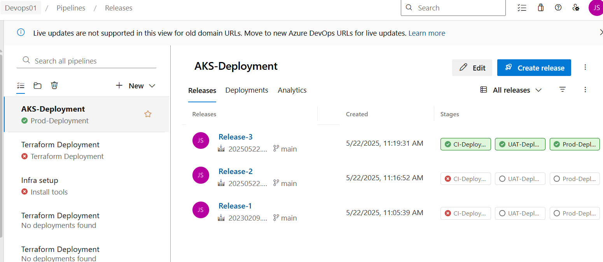

**Azure DevOps AKS Deployment**

1. Created AKS through terraform

2. create "kube.yaml" file into the web-01 source code
kube.yaml 

3. updated web-01 pipeline to push the artifact to the drop location

- task: CopyFiles@2
  inputs:
    Contents: '**'
    TargetFolder: '$(Build.ArtifactStagingDirectory)'
- task: PublishBuildArtifacts@1
  inputs:
    PathtoPublish: '$(Build.ArtifactStagingDirectory)'
    ArtifactName: 'drop'
    publishLocation: 'Container'

4. created release pipeline to deploy the pod to AKS

